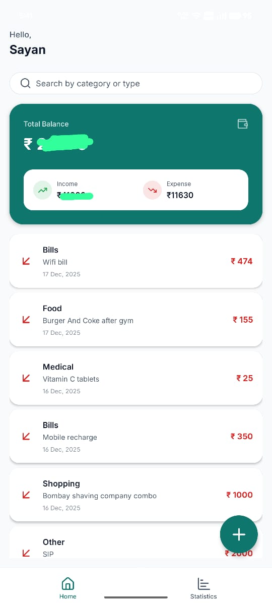
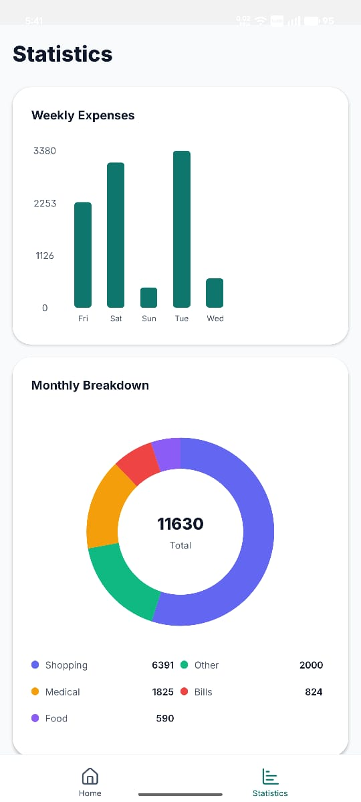
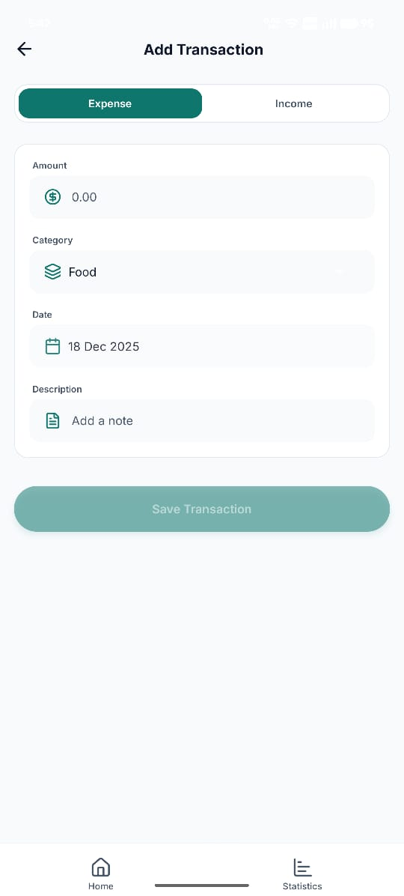
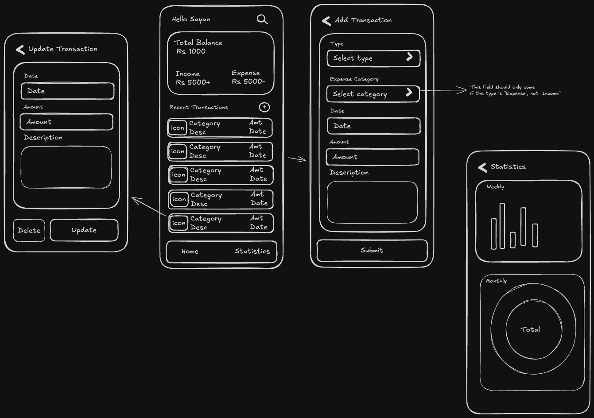

# My Expense Tracker

A modern, intuitive mobile expense tracker application built with **React Native** and **Expo**. This app helps you manage your finances by tracking income and expenses, providing visual statistics, and keeping your data synced with **Supabase**.

## 🚀 Features

- **Dashboard Overview**: View your current balance, total income, and total expenses at a glance.
- **Transaction Management**:
  - Add new income or expense transactions with categories.
  - Update existing transactions.
  - Delete unwanted records.
- **Smart Search**: Filter transactions by category or type instantly.
- **Visual Statistics**:
  - **Weekly Breakdown**: Interactive bar charts showing daily spending.
  - **Monthly Analysis**: Pie charts categorizing your expenses.
- **Secure Backend**: Real-time data storage and authentication using Supabase.

## 🛠️ Tech Stack

- **Framework**: [Expo](https://expo.dev/) (React Native)
- **Language**: TypeScript
- **Backend/Database**: [Supabase](https://supabase.com/)
- **Charts**: `react-native-gifted-charts`
- **Icons**: `lucide-react-native`
- **Navigation**: `expo-router`

## 📸 Screenshots

<div style="display: flex; flex-direction: row; gap: 10px;">
  
  
  
  
</div>

## 🔄 Workflow Diagram



## 📦 Installation & Running

Follow these steps to set up the project locally:

1.  **Clone the repository:**

    ```bash
    git clone <repository-url>
    cd my-expense-tracker
    ```

2.  **Install dependencies:**

    ```bash
    npm install
    ```

3.  **Set up Environment Variables:**
    Create a `.env` file in the root directory and add your Supabase credentials:

    ```env
    EXPO_PUBLIC_SUPABASE_URL=your_supabase_url
    EXPO_PUBLIC_SUPABASE_ANON_KEY=your_supabase_anon_key
    ```

4.  **Run the app:**

    ```bash
    npx expo start
    ```

5.  **Run on Device/Emulator:**
    - Scan the QR code with the **Expo Go** app (Android/iOS).
    - Press `a` for Android Emulator.
    - Press `i` for iOS Simulator.

## 🤝 Contributing

Contributions are welcome! Feel free to open an issue or submit a pull request.
